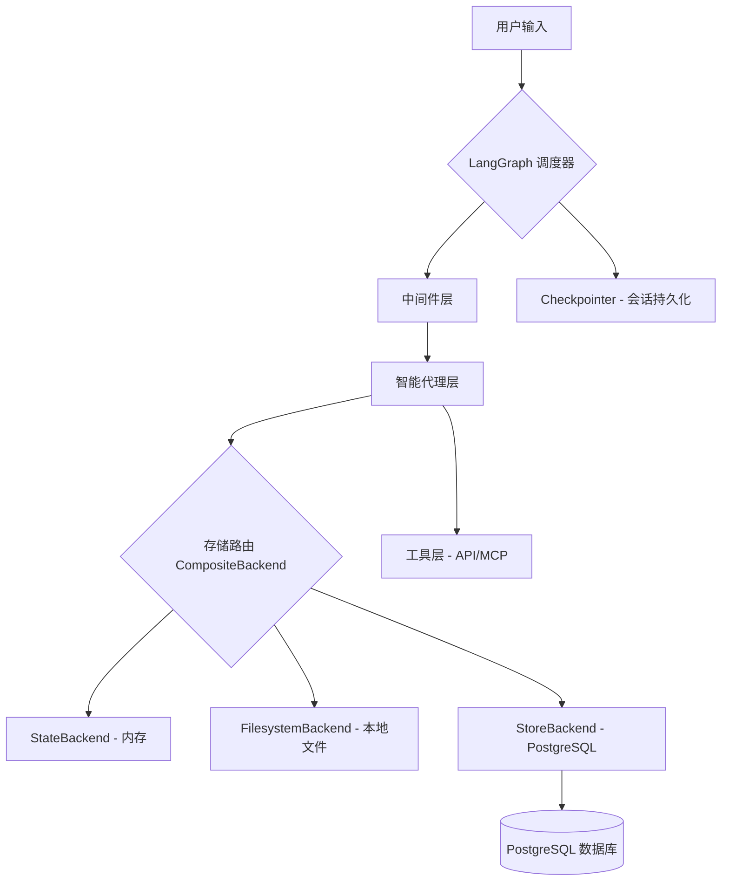

# LangGraph Deep Agent System 架构文档

本文档详细描述了 **LangGraph Deep Agent System** 的技术架构、核心组件及其交互机制。

## 1. 总体架构概览

系统采用分层架构设计，利用 LangGraph 框架实现状态化的多代理协同。其核心设计理念是 **“存储路由化”** 和 **“代理专业化”**。

---

## 2. 核心组件详解

### 2.1 状态管理层 (State Management)
系统通过 `AgentState` 维护会话的完整生命周期：
- **[agent_state.py](src/graph/agent_state.py)**: 定义了 `conversation_history` (对话历史)、`current_agent` (当前活跃代理)、`user_id` 等关键状态字段。
- **持久化机制**: 使用 PostgreSQL 作为 Checkpointer，通过 `AsyncPostgresSaver` 实现线程级别的状态保存，支持会话的中断与恢复。

### 2.2 存储后端 (Storage Backends)
系统实现了高度灵活的存储抽象，支持根据路径动态路由：
- **CompositeBackend**: 核心路由引擎，采用最长前缀匹配原则将文件操作分发到不同后端。
- **[backend.py](src/backend/backend.py)**: 实现了 `NamespacedStoreBackend`，支持基于 `user_id` 和 `thread_id` 的多租户数据隔离。
- **路由规则示例**:
    - `/tmp/` -> `StateBackend`: 高性能内存存储，适用于临时中间数据。
    - `/workspace/` -> `FilesystemBackend`: 安全沙盒化的本地磁盘操作。
    - `/memories/` -> `StoreBackend`: 基于数据库的跨会话长期记忆。

### 2.3 专业化代理层 (Specialized Agents)
系统内置了 8 种预定义的代理配置，通过 `create_deep_agent` 工厂函数创建：
- **[deep_agent.py](src/deep_agents/deep_agent.py)**:
    - **Analytics_Agent**: 纯内存后端，针对大数据分析优化。
    - **Role_Playing_Agent**: 强化了性格一致性和情感记忆。
    - **Enterprise_Agent**: 强制审计日志记录和严格的文件权限控制。
- **委派机制**: 复杂代理可将工具调用任务委派给专门的 `tools_Assistant`。

### 2.4 中间件系统 (Middleware)
在代理执行前后介入，处理横切关注点：
- **[middleware.py](src/middlewares/middleware.py)**:
    - **智能摘要 (Summarization)**: 当 Token 超过阈值（如 10,000）时，自动触发上下文压缩，优先保留错误解法和设计决策。
    - **任务管理 (TodoList)**: 自动识别复杂任务并强制代理维护 TODO 列表。
    - **重试机制 (ToolRetry)**: 针对不稳定的 API 调用提供指数退避重试。

### 2.5 模型与工具集成 (Models & Tools)
- **[llm.py](src/models/llm.py)**: 统一的模型加载接口，支持 GPT-4o、DeepSeek、Gemini 及本地 Ollama 模型。
- **[api_tools.py](src/tools/api_tools.py)**: 提供标准化的 API 调用工具，支持模型上下文协议 (MCP)。

---

## 3. 关键工作流

1.  **会话初始化**: `create_simple_graph` 初始化 LangGraph 流程，并连接 PostgreSQL 数据库。
2.  **任务分发**: `intelligent_node` 根据用户意图和当前状态，选择最合适的 Deep Agent。
3.  **中间件拦截**: `SummarizationMiddleware` 检查历史长度，必要时进行压缩以节省 Token。
4.  **执行与存储**: 代理执行过程中，涉及存储的操作（如写入笔记）会经由 `CompositeBackend` 自动选择物理存储位置。
5.  **状态持久化**: 每次迭代完成后，`AsyncPostgresSaver` 自动更新数据库中的 Checkpoint。

---

## 4. 性能与安全优化

- **异步优先**: 全链路采用 `asyncio`，在高并发场景下保持响应。
- **内存优化**: 关键分析路径避开磁盘 I/O，使用 `StateBackend` 提升处理速度。
- **沙盒化**: `FilesystemBackend` 强制开启 `virtual_mode`，限制代理仅能访问指定的 `workspace` 目录。
- **多租户隔离**: 通过 `NamespacedStoreBackend` 确保用户间数据不可见。
